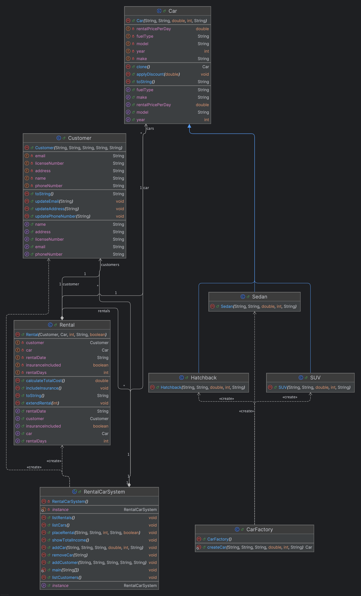

# RentalCarSystem

A modular and extensible **Car Rental System** implemented in Java using **multiple Design Patterns**.  
The project includes real-world object models such as `Car`, `Customer`, and `Rental`, with clean separation of concerns and a strong OOP architecture.

---

## Features

- Add/remove/list **cars** and **customers**
- Place and list **rental transactions**
- Calculate **total rental income**
- Dynamic **car feature extensions** (e.g. GPS, child seat)
- Flexible **payment strategies** (credit card, PayPal)
- Support for **cloning**, **object reuse**, and **currency adaptation**

---

## Design Patterns Used

| Pattern        | Purpose |
|----------------|---------|
| **Factory**    | To create car objects based on type (Sedan, SUV, Hatchback) |
| **Strategy**   | For selecting different payment methods dynamically |
| **Decorator**  | For adding optional features to cars without altering their structure |
| **Bridge**     | To decouple Rental from specific PaymentSystem implementations |
| **Flyweight**  | To minimize memory usage by sharing identical car objects |
| **Adapter**    | To convert Euro prices to Dollar via currency adapter |
| **Prototype**  | To create cloned car objects efficiently |
| **Object Type**| To demonstrate polymorphism between car types |
| **Singleton**  | (Optional demo) for shared access if needed |

---

## Legacy Demo: `Large.java` (God Object Example)

The `Large` class is a legacy or experimental file demonstrating a **monolithic, anti-pattern approach** to building a car rental system.  
It combines all functionalities — car management, customer handling, rental processing, and main execution — in a **single, overly large class**.

This class includes:
- **Inner classes** for `Car`, `Customer`, and `Rental`
- Methods to add/list/remove cars and customers
- Rental processing and income calculation logic
- A `main()` method acting as a standalone executable

While functional, it violates several design principles such as:
- **Single Responsibility Principle**
- **Separation of Concerns**
- **Modularity & Reusability**

It serves as a **contrast** to the modular, design-pattern-based implementation of the rest of the project.

> This file is intentionally kept as a **counter-example** to highlight the benefits of applying design patterns and clean architecture.
